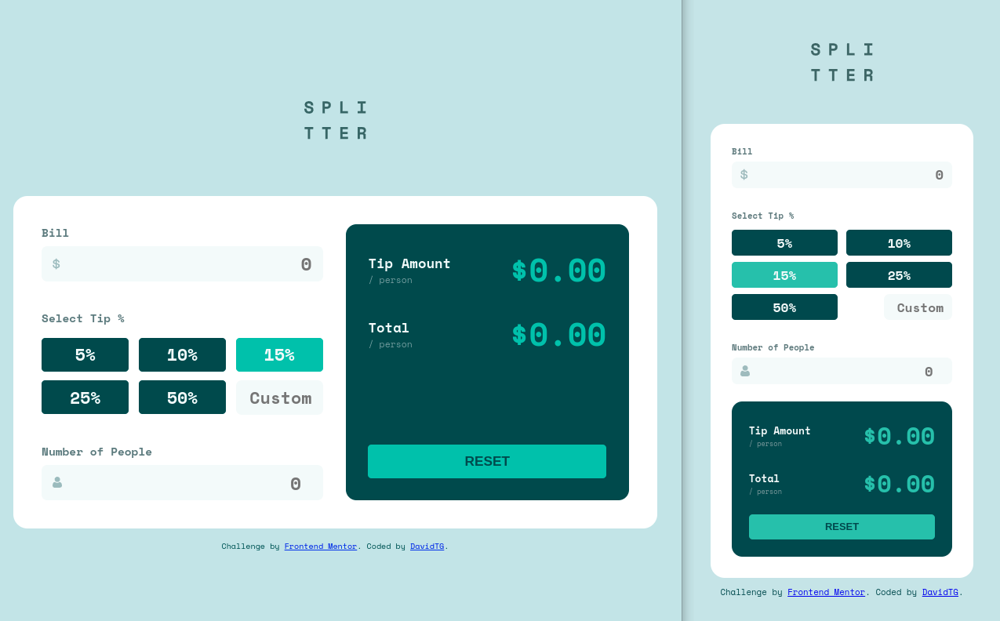

# Frontend Mentor - Tip calculator app solution

This is a solution to the [Tip calculator app challenge on Frontend Mentor](https://www.frontendmentor.io/challenges/tip-calculator-app-ugJNGbJUX). Frontend Mentor challenges help you improve your coding skills by building realistic projects.

## Table of contents

- [Overview](#overview)
  - [The challenge](#the-challenge)
  - [Screenshot](#screenshot)
  - [Links](#links)
- [My process](#my-process)
  - [Built with](#built-with)
  - [What I learned](#what-i-learned)
  - [Continued development](#continued-development)
  - [Useful resources](#useful-resources)
- [Author](#author)
- [Acknowledgments](#acknowledgments)

## Overview

### The challenge

Users should be able to:

- View the optimal layout for the app depending on their device's screen size.
- See hover states for all interactive elements on the page.
- Calculate the correct tip and total cost of the bill per person.

### Screenshot



### Links

- Solution URL: [Add solution URL here](https://github.com/DavidTG7/tip_calculator)
- Live Site URL: [Add live site URL here](https://davidtg7.github.io/tip_calculator/)

## My process

### Built with

- Semantic HTML5 markup
- CSS custom properties
- Flexbox
- CSS Grid
- Mobile-first workflow
- [React](https://reactjs.org/) - JS library

### What I learned

Some HTML code I'm proud of:

Using variables to store color values used all over the app:
```css
:root {
  --strong-cyan: hsl(172, 67%, 45%);
  --very-dark-cyan: hsl(183, 100%, 15%);
  --dark-grayish-cyan: hsl(186, 14%, 43%);
  --grayish-cyan: hsl(184, 14%, 56%);
  --light-grayish-cyan: hsl(185, 41%, 84%);
  --very-light-grayish-cyan: hsl(189, 41%, 97%);
  --white: hsl(0, 0%, 100%);
  --hover-light-cyan: hsl(172, 49%, 69%);
}
```

Creating Media Queries for Responsive Design:
```css
@media screen and (max-width: 710px) {
  main {
    margin: auto;
    flex-flow: column;
    width: 26rem;
    align-items: center;
  }
  
  .left,.right {
    width: 100%;
  }

  .left__tip-options_buttons button {
    width: 48%;
  }
}
```

Manipulate the Component's Lifecycle Using Dependencies in the useEffect Hook:
```js
useEffect(() => {
    if (!billAmount.length || !peopleAmount.length) {
      setTipAmount("0.00");
      setTotalAmount("0.00");
    }
  }, [billAmount, peopleAmount, percentage, tipAmount]);
```

### Continued development

In the future, I will focus more on using Hooks and implementing Sass.

## Author

- LinkedIn - [@david-tg](https://www.linkedin.com/in/david-tg/)
- Frontend Mentor - [@DavidTG7](https://www.frontendmentor.io/profile/DavidTG7)
- GitHub - [@DavidTG7](https://github.com/DavidTG7)
- Twitter - [@DavidLTG](https://www.twitter.com/DavidLTG)
